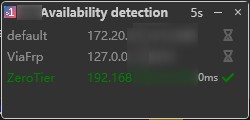

# Alternative-credential

1Remote allow you add credentials for alternative use. You can switch between them manually or automatically when open connections.

## Why

Since we need to connect to server with different permissions, we need to support multiple credentials. For example:

- Case1: You connect to a server with a normal account mostly, and connect to the same server with a root account when do some maintenance work.
- Case2: You connect to your NAS with LAN address at home, while connect to the same NAS with WAN address when you are outside.

In these case, "**Alternative-credential**" can help you smoothly switch between different address and account.

## Add/Edit

In edit page, there's a session for alternative credentials. You can add a new credential by clicking the **`+`** button. Also you can edit or delete a credential by clicking the **`Edit`** button or **`Delete`** button.

When you add a new credential, you need to fill the name, others are optional. The name is used to identify the credential, and it will be shown in the credential list.

## Work with

Then you can use the credential in the following places:

### List

### Launcher(**By press key ++right++**)

## Auto switching address

If you got **`Automatic address switching`** enabled, 1Remote will automatically switch to the alternative address when you connect to the server(according to the ping result).

You **have no need** to switch the address to WLAN manually when you are outside:).
