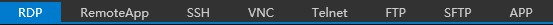
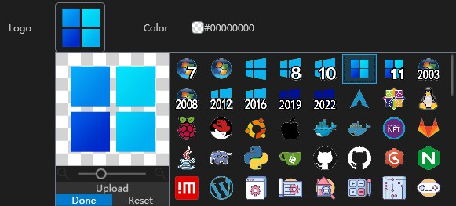
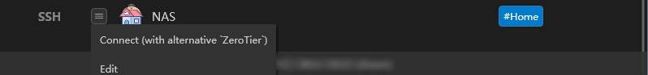

# Data management

## Managing Servers

### Adding Server

1. Click the **`+`** button in the upper-right corner of the main window.

    

2. Choose a protocol, such as RDP, SSH, or VNC, at the top of the pop-up window.

    

3. Set the server's name, tags, notes (supports Markdown), and others.
4. (Optional) Customize the server icon (system-built or manually uploaded) and highlight color (default is no highlight, setting a highlight color will highlight the server in the list and connection process).

    

5. (Optional) Configure scripts for the server, such as opening VPN before starting remote desktop, or closing VPN after closing remote desktop. Scripts support cmd, PowerShell, and Python. Please see the [Open a VPN before connect](usage/misc/open-a-vpn-before-connect.md) for further details.

6. Continue entering server **address**, **port**, **credentials** and other information, and select your desired connection settings.
7. Click the **`Save`** button to complete adding the server and return to the homepage.

#### Importing from mRemoteNG

1. In mRemoteNG, right-click on the server and choose "**Export to File...**". Set the "**File Format**" to "**mRemoteNG CSV**" in the pop-up window, and click the **`OK`** button in the lower-right corner to export.
2. In 1Remote, click the **`+`** button in the upper-right corner of the main window, and choose "import mRemoteNG csv". Select the CSV file you just exported in the pop-up dialog, and click "Open" to complete the import.

#### Importing from RDP Files

1. In MSTSC.exe, click "Show Options" to expand the window, click the **`Save As...`** button under "Connection settings", and save as an RDP file.
2. In 1Remote, click the **`+`** button in the upper-right corner of the main window, and choose "**import *.rdp**". Select the RDP file you just saved in the pop-up dialog, and click "Open" to complete the import.

!!! warning
    We are not able to get password form RDP file, so you may have to enter password manually.

### Style switching

Servers are displayed in the main window as cards or lists. You can click the **`Settings`** button in the upper-right corner of the interface to expand the menu and choose "Toggle Cards/List" to switch the display mode of servers.

### Sorting

- In list mode, click on the header above the list to sort the servers.
- Or you can click the **`Settings`** button in the upper-right corner of the interface to expand the menu and choose "**Sorting**" to sort the servers.
  - If **Sort by drag** is selected, you can drag the server to the desired position to sort the servers.

### Edit

- When you move mouse over a server, the **`Settings`** button will be displayed. Clicking on this button will display a menu where you can connect to, edit, create a replica, delete, copy the server address and account password, etc. (Note: If you connect to a MySQL server with read-only permissions, you will not be able to edit, copy, or delete server information stored in that database.)

    

- You can also directly enter the edit interface by right-clicking on a server with your mouse.
- By selecting multiple servers using the checkboxes and clicking the **`Edit`** button at the bottom of the main window, you can enter the batch editing interface to perform uniform editing operations on multiple servers. With proper server labels, you can easily select all servers under a specific label and modify their addresses or account passwords in bulk.

    

