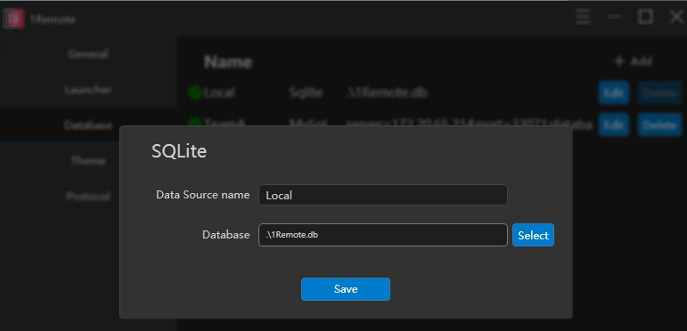

You may work with multiple devices to manage your servers. In this case, you can use the database synchronization settings to share server information across different devices.

## By export

Nothing to talk about, export, copy to other device, import...over.

## Sqlite Synchronization

- Our main database is a un-occupied Sqlite database, so you can copy the database while 1Remote is still in used.
- We will check update and reload data every X minutes.

This means you can copy the database to other device using sync tools, and 1Remote will automatically detect the change and run a data reload procedure.

> please do not remove the database file while 1Remote is still in used.

!!! tip
    In `Options` -> `Database` -> `Local` -> `Edit`, you can check up where your database file is. 

    You can also change the db path there.

recommended tools:

- Synology NAS: [Cloud Station](https://www.synology.com/en-us/dsm/feature/cloud_station)
- Google Drive: [Google Drive](https://www.google.com/drive/)
- OneDrive: [OneDrive](https://www.onedrive.com/)
- Jianguoyun: [Jianguoyun](https://www.jianguoyun.com/)

## By using MySQL

- Data export: By selecting multiple servers using the checkboxes and clicking the `Export` button at the bottom of the main window, you can export the server information to a JSON file. (Note that the exported data is stored in plain text, so please handle it with care.)
- Database backup: Click the **`Settings`** button in the top right corner of the main window, expand the menu, select the **`Options`** button, and go to the Database tab. Find the database named "Local" and you can see its storage path. You can manually enter this path to backup the database.
- Database synchronization: If you use multiple devices, you can back up the database to the cloud and set the synchronization path on each device, so that you can share server information across different devices.
    1. First, move the "Local" database file to the sync folder. Synology NAS, OneDrive, Google Drive, and other cloud storage services can be used as sync service providers.
    2. Click the **`Edit`** button to the right of the "Local" database in the **`Database`** tab, then click the **`Select`** button in the pop-up window and choose the database file you moved to the sync folder. Save the changes.
    3. The app will check whether the database file has changed every once in a while. If changes are detected, the file will be automatically synchronized to the database.
    4. (Note: This app does not use concurrency locks on the data, so if you modify the database on multiple devices at the same time, data loss may occur. Please try to avoid this situation.)
