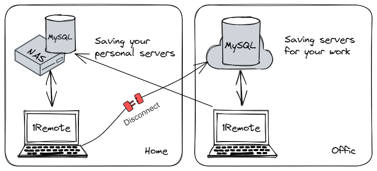
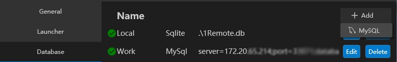
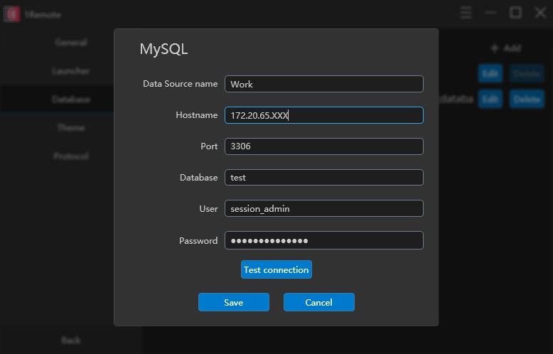
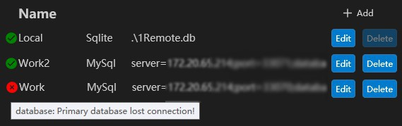
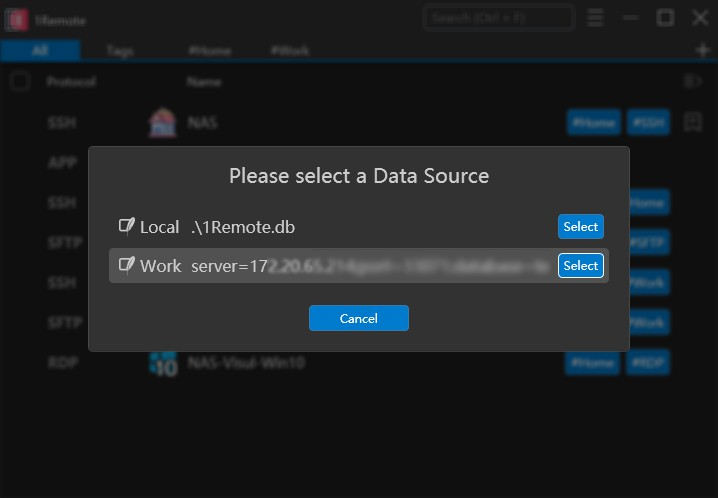
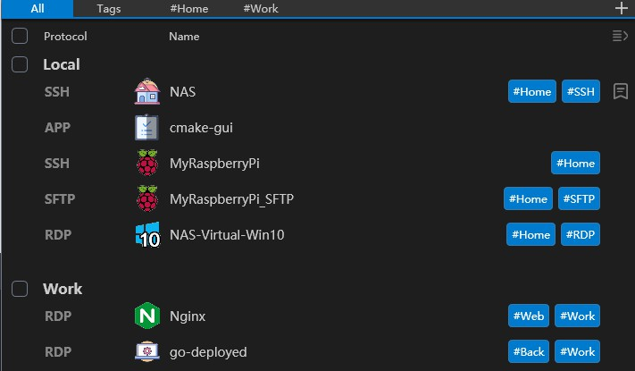

# Use online database

1Remote supports various data sources such as local SQLite databases and online MySQL databases. You can connect to multiple databases at the same time. which allows you to store different server information in different databases and connect to different databases on different devices for flexible data management.

This is where configuring multiple databases becomes useful:

- **At home**: Connect to the MySQL database on your NAS to manage your personal servers when you back home.
- **On work**: Connect to both the MySQL on your home NAS and the MySQL on your company server to access the servers for work when you are in your office.
- **For team**: With MySQL, you can share the server with your colleagues, make them connect to different MySQL database can make sure they can only see the servers they have permission to access, more detail: [Team sharing](usage/team/team-sharing.md)

## Use MySQL

Go to `Options` -> `Database` -> `MySQL` to set up the database

Fill the database info, make sure your account have the permission to read & write the database.

Press **Save** and your database will on the list. If connect failed, the database will be marked with a red cross.

If there are multiple databases, you need select the database when you add a new server.

After you add a new server, you will find the list is grouped by database.

<!-- 

- Your personal server information is stored in the default **`Local`** database, which only you can see and use.
- The team's servers are stored in a MySQL database named **`Team.`** You and your boss can connect with an administrator account to add and modify servers, while other colleagues can only read the server list with a read-only account.
Specifically:
    1. Install MySQL. In this article, we use the Synology package to install and deploy MySQL.
    2. Create a new database in MySQL. Here, we create a database named session_ai, which doesn't need to have any tables.
    3. Create a new account named session_admin in MySQL and grant it all privileges to the session_ai database.
    4. On the **`Database`** tab page in the **`Setting`** section of 1Remote, click the **`Add`** button in the upper right corner to add a new MySQL database.
    5. Go back to the main page of 1Remote and click the **`+`** button in the upper right corner to add a new server configuration to the newly added database.
    6. Create a new account named session_user in MySQL and only grant it select permission to the session_ai database. Distribute this account to your team members so that they can read the server configuration stored in the session_ai database but cannot view or modify their passwords.
    7. Noted: 1Remote updates data by querying periodically. Therefore, when you modify server information, other users may need to wait for several seconds before they can get the latest data. -->
