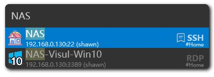
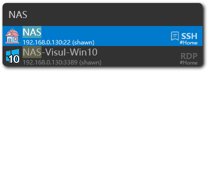
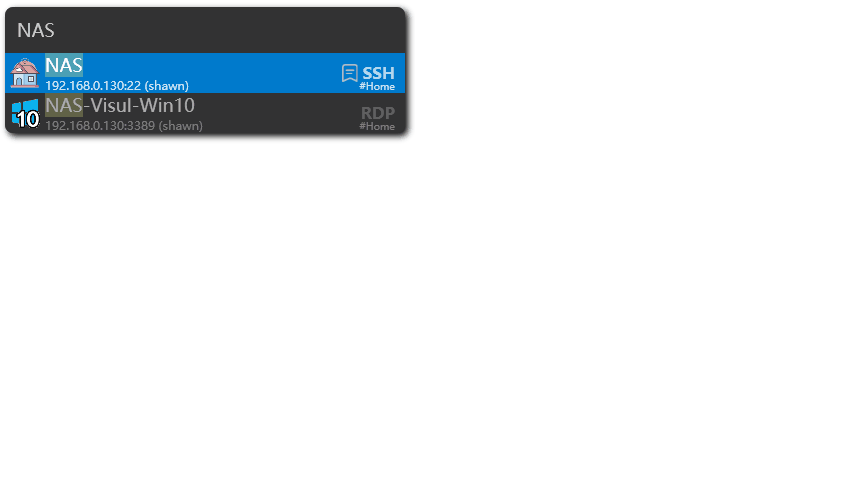

# Launcher

Launcher is a place where you can quickly start a remote session. You can use the default shortcut ++alt++ + ++m++ to open the quick start window of the server.

!!! note
    Launcher will be shown on the screen where your mouse is.

## Select

In launcher, items are ordering by recent use. Use the ++up++ and ++down++ arrow keys to select the desired server, or give some keywords to search for the desired server.

++enter++ key or mouse double click it to start the remote session.

## Options

When you select a server, you can use the ++righ++ arrow key to open the options menu. There you can choose a credential to connect to the server.

++left++ arrow key to go back to the server list.

## Show note

If you write a note for the server, you can use the ++left++ arrow key to show the note.

Or simply click the note icon.



