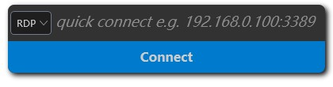
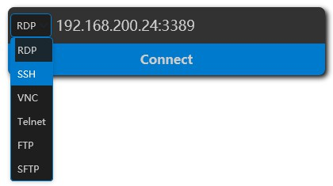
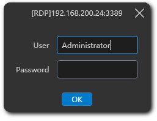
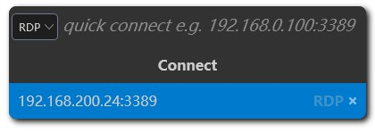

# Quick connect

In launcher you can make a quick connect to a server without creating a server profile.

After the launcher shows up, press the ++tab++ key to switch to the quick connect mode.

In this view you can select the protocol and fill the ip and port, then start the remote session.

One you press ++enter++ key, a password acquire window will show up, you need to fill the password before continue.

1Remote will help you remember your quick connect history, so you don't have to type the ip and port next time.

!!! warning
    We don't save the credential for security season, so you need to fill the password every time you start a quick connect session.


