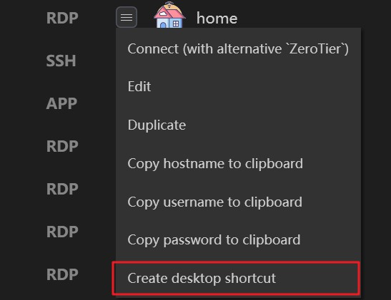
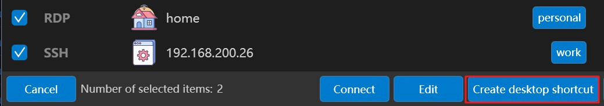
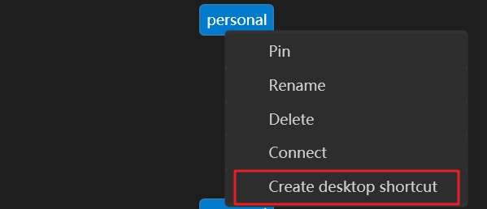
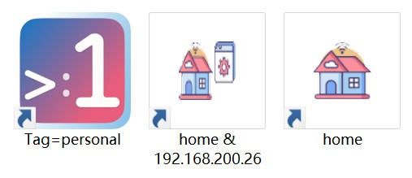

# Creating Desktop shortcut for connections

Thanks to our [CLI feature](cli.md), 1Remote finally supports adding desktop shortcuts for sessions.

You can create desktop shortcuts for **individual servers**, **multiple servers**, or all servers under a specific **Tag**. Simply right-click on the corresponding item and select "Create Desktop Shortcut."

## individual servers

## multiple servers

## Tag

## Shortcut demonstration

