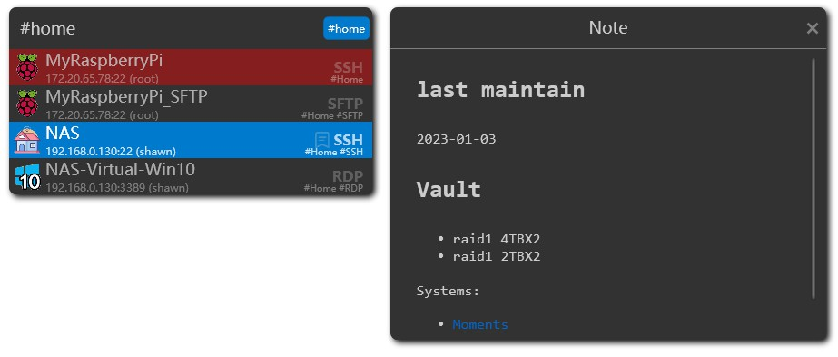
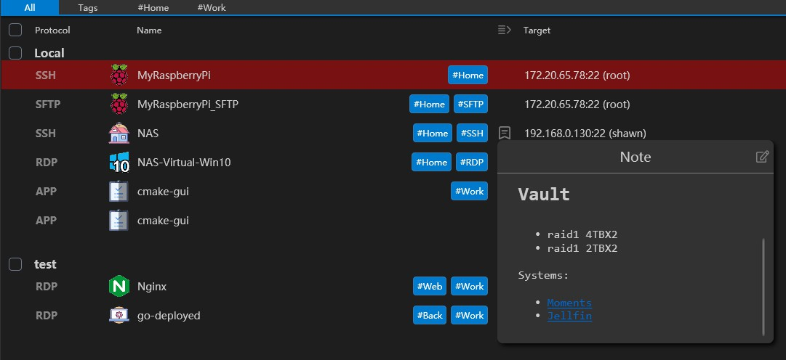
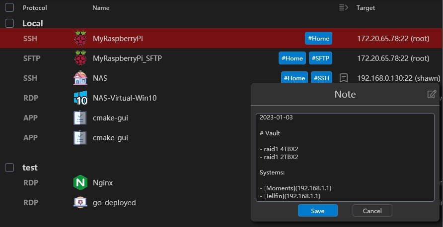

We support markdown note to help you remember some important information. The note will be displayed in the connection list and the connection detail page.

You can edit the note in the edit page or click the edit button on top-right of the note.

We support link, image and others markdown syntax.

