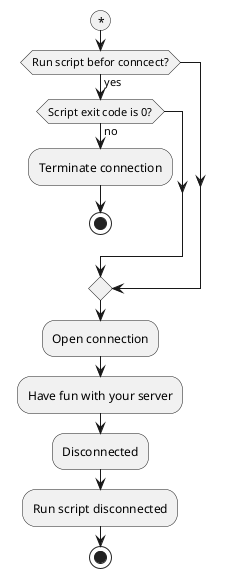
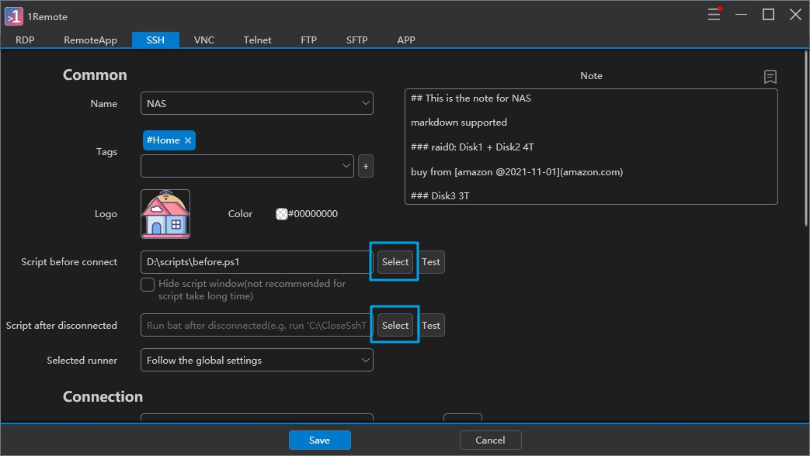
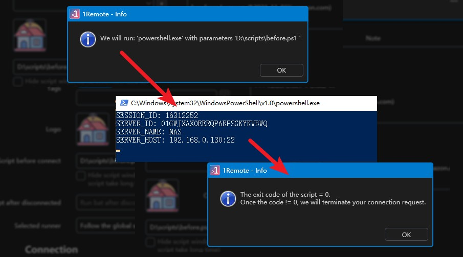

# Using Pre- and Post-Connection Scripts in 1Remote

1Remote is a remote access application that allows users to establish connections to remote computers. One of its features is the ability to run pre- and post-connection scripts. These scripts can be written in cmd(*.bat), PowerShell(*.ps1) or Python(*.py) and can be used to perform various tasks before a connection is established or after it disconnected.



To facilitate the script in identify each sessions, 1Remote will start the script with **`SESSION_ID`**, **`SERVER_ID`**, **`SERVER_NAME`**, and **`SERVER_HOST`** as environment variables.

!!! note
    Noted：For the same server, the **SESSION_ID** for each session is different, while **SERVER_ID**, **SERVER_NAME**, and **SERVER_HOST** remain the same.

## Setting Up Scripts

To set up a script in 1Remote:

1. Find a place to keep your script files, and create scripts there.
2. Navigate to the `Edit` page of your server in 1Remote.
3. Click the `Select` button and select the script file you want.

    

4. Click `Test` button to test the script, the debug info will popup.

    

5. If it is all green, click `Save` button to save.
6. Then your script will be run every time you start this server.

## Example Pre-Connection Script

Here is an example of a script. The script will be executed in the directory where the script file is.

``` powershell
$sessionID = $env:SESSION_ID
$serverID = $env:SERVER_ID
$serverName = $env:SERVER_NAME
$serverHost = $env:SERVER_HOST
$serverTags = $env:SERVER_TAGS

echo "SESSION_ID: $sessionID"
echo "SERVER_ID: $serverID"
echo "SERVER_NAME: $serverName"
echo "SERVER_HOST: $serverHost"
echo "SERVER_TAGS: $serverTags"


Set-Content -Path "temp.txt" -Value "SESSION_ID: $sessionID`r`nSERVER_ID: $serverID`r`nSERVER_NAME: $serverName`r`nSERVER_HOST: $serverHost`r`SERVER_TAGS: $serverTags"

# in the script before connect:
# TODO: save $sessionID into file in pre-connect script
# TODO: if $serverTags contains "HOME" then open VPN1
# TODO: if $serverTags contains "WORK" then open VPN2


# in the script after disconnected:
# TODO: read $sessionID from file in post-connect script
# TODO: if $sessionID == "12345" then close VPN1
# TODO: if $sessionID == "ABCDE" then close VPN2


# do some long time jobs, like opening a VPN
sleep 3

# exit with non-zero will terminate your connection request.
exit 0
```

A typical application is to open a VPN before establishing a remote connection, and automatically close the VPN after terminating the remote connection.

[Learn more](/usage/misc/pre-post-script-control/open-a-vpn-before-connect){ .md-button }


