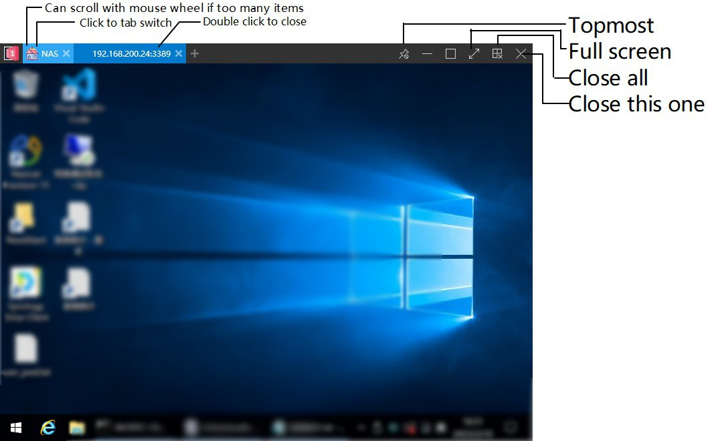

## Managing Servers

### Adding Server

1. Click the **`+`** button in the upper-right corner of the main window.

    

2. Choose a protocol, such as RDP, SSH, or VNC, at the top of the pop-up window.

    

3. Set the server's name, tags, notes (supports Markdown), and others.
4. (Optional) Customize the server icon (system-built or manually uploaded) and highlight color (default is no highlight, setting a highlight color will highlight the server in the list and connection process).

    

5. (Optional) Configure scripts for the server, such as opening VPN before starting remote desktop, or closing VPN after closing remote desktop. Scripts support cmd, PowerShell, and Python. Please see the [Open a VPN before connect](usage/misc/open-a-vpn-before-connect.md) for further details.

6. Continue entering server **address**, **port**, **credentials** and other information, and select your desired connection settings.
7. Click the **`Save`** button to complete adding the server and return to the homepage.

### Style switching

Servers are displayed in the main window as cards or lists. You can click the **`Settings`** button in the upper-right corner of the interface to expand the menu and choose **`Toggle Cards/List`** to switch the display mode of servers.

### Sorting

- In list mode, click on the header above the list to sort the servers.
- Or you can click the **`Settings`** button in the upper-right corner of the interface to expand the menu and choose "**Sorting**" to sort the servers.
  - If **Sort by drag** is selected, you can drag the server to the desired position to sort the servers.

### Edit

When you move mouse over a server, the **`Settings`** button will be displayed. Clicking on this button will display a menu where you can connect to, edit, create a replica, delete, copy the server address and account password, etc. (Note: If you connect to a MySQL server with read-only permissions, you will not be able to edit, copy, or delete server information stored in that database.)

!!! tip
    You can also directly enter the edit interface by right-clicking on a server with your mouse.

### Bulk edit

By selecting multiple servers using the checkboxes and clicking the **`Edit`** button at the bottom of the main window, you can enter the batch editing interface to perform uniform editing operations on multiple servers. With proper server labels, you can easily select all servers under a specific label and modify their addresses or account passwords in bulk.

### Data export

!!! warning inline end
    The exported data is stored in plain text, so please handle it with care.

When some servers are selected, **`Export`** button can export selected items to json file which you can import it to another PC or simply make a backup. Please see the [Data synchronization](usage/database/data-synchronization.md) for further details.

### Data import

1. Click the **`+`** button in the upper-right corner of the main window
2. Click **`import json`** to import json file exported from 1Remote.

#### Importing from mRemoteNG

1. In mRemoteNG, right-click on the server and choose "**Export to File...**". Set the "**File Format**" to "**mRemoteNG CSV**" in the pop-up window, and click the **`OK`** button in the lower-right corner to export.
2. In 1Remote, click the **`+`** button in the upper-right corner of the main window, and choose "import mRemoteNG csv". Select the CSV file you just exported in the pop-up dialog, and click "Open" to complete the import.

#### Importing from PRemoteM

Since PRemoteM is our old name, you can also import data from PRemoteM.

Our migration tool will auto detect your old data when your first start {{appname}}.

If the you miss the auto-migration, you can still import it manually:

1. In PRemoteM export all data following the [Data export](#data-export) guide, you will get a *.prma file.
2. In {{appname}} click the **`+`** button in the upper-right corner then click the **`Import`** button, select the *.prma file you just exported in the pop-up dialog by select the file filter \*\.\*, and click "Open" to complete the import.

#### Importing from RDP Files

!!! warning inline end
    We are not able to get password form RDP file, so you may have to enter password manually.

1. In MSTSC.exe, click "Show Options" to expand the window, click the **`Save As...`** button under "Connection settings", and save as an RDP file.
2. In {{appname}}, click the **`+`** button in the upper-right corner of the main window, and choose "**import *.rdp**". Select the RDP file you just saved in the pop-up dialog, and click "Open" to complete the import.

## Starting Remote Connections

### Starting from the main window

1. Servers are displayed in the main window as cards or lists. Double-click a server to open the corresponding remote session.
2. You can also check the checkbox in front of each server, and then click the **`Connect`** button at the bottom of the main window to start multiple remote sessions at once.
3. If you have labeled the servers, you can right-click the label in the label list above the main window, and click the **`Connect`** button to start multiple remote sessions at once.

### Starting from the Launcher

You can use the default shortcut ++alt++ + ++m++ call the launcher, then type some key words to search the server you want to connect, then press ++enter++ to start.

For more details about the Launcher, please see the [Launcher](usage/launcher/basic.md).

## Session view

Remote session windows are displayed in the window as tabs. You can detach the tab to a new window by dragging the tab to the upper-left corner of the window.

## Tag management

You can add multi-tag for each server, all your Tags will be shown on **Tag page**.

A short cut of the tags selected in this page will be display on the top bar for quick access.

> I suggest making a tag name as short as you can to save space.

### Rename tag

Right-click on tag and you will find a **`Rename`** button.

### Multiple filter

If you need a strong tag management, you can use multiple filter to find the server you want.

By click / right-click / ctrl-click on the tag, you can include or exclude the tag

e.g. sometimes I wanna list all my servers in home but exclude RDP.


