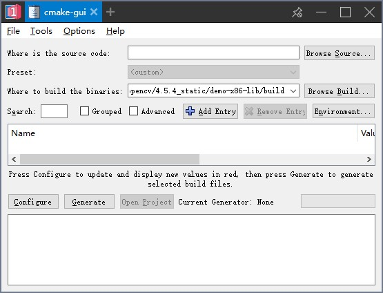

The APP protocol allows you to start an external EXE program using 1Remote.

By passing the parameters to the program, you can customize the startup configuration of the program.

Then you can start the software you need from our launcher.

## Examples

Here are some examples of using the App protocol, you can also customize the required startup configuration according to your own needs.

### Open bing.com with Chrome

### Cmake

### Open NoMachine with credential `Test.nxs`

## How to use(NoMachine case)

Since the latest version of NoMachine no longer provides a session starting method of the command line by password, in 1Remote we define the App protocol to indirectly implement the NoMachine session.

1. Make sure the target machine can be connected with NoMachine. Right click and export the `.nxs` file of target machine.

    

2. In 1Remote, add a new configuration of `APP` type.
   - Fill the path of NXPlayer.exe into the EXE path field
   - Fill the path of `.nxs` file into the parameter field
   - Save

    

3. Then you can quickly start your NoMachine session from 1Remote.

    

!!! tip
    This is also applicable to other command parameters supported session launcher, such as PUTTY, WinSCP, etc.

    Even you can use this method to add one other programs (such as Word, NotePad, etc.) to 1Remote for a quick start.


