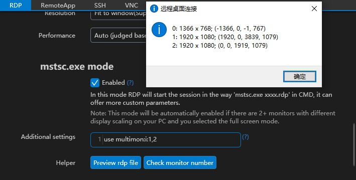

## What is "mstsc.exe mode"
In this mode, rdp session will be start by run command `mstsc.exe xxxx.rdp` in cmd.

## Why "mstsc.exe mode"

When our user using 2 monitors with different scale ratios and wants to go to full-all-screens, we didn't find a solution to handle this 2 different scale ratios on [Remote Desktop ActiveX control](https://docs.microsoft.com/en-us/windows/win32/termserv/remote-desktop-activex-control).

Then we make 1Remote check user's monitor resolution and scale ratios before a multi-monitors full-screen rdp session start. If we found 2 monitors with different scale ratios, a temp file 'xxxx.rdp' will be created and 1Remote will call cmd command `mstsc.exe xxxx.rdp` to start the session.

## Additional settings

In the process of development, we found it in the `.rdp` file there are many settings that [Remote Desktop ActiveX control](https://docs.microsoft.com/en-us/windows/win32/termserv/remote-desktop-activex-control) can't access.

such as:

| setting                | description                                                                                                                                                                                                                                |
| ---------------------- | ------------------------------------------------------------------------------------------------------------------------------------------------------------------------------------------------------------------------------------------ |
| selectedmonitors:s:0,2 | When you connect 3 monitors, this setting allow you only uses the NO.0 & NO.2 display to display the remote desktop. The NO.1 display will continue to display your local desktop. Using cmd `mstsc /l` can see the number of the monitors |
| redirectcomports:i:1   | Redirect the COM port of the local machine to the remote session.                                                                                                                                                                          |
| desktopwidth:i:800     | Specifies the resolution width (in pixels) of the remote session to 800pix.                                                                                                                                                                |
| desktopheight:i:600    | Specifies the resolution height (in pixels) of the remote session to 600pix.                                                                                                                                                               |

For example, I have 3 monitors, and I want to use the NO.1 & NO.2 display for remote desktop, and keep NO.0 as my local desktop:

more settings：

- [Microsoft](https://docs.microsoft.com/en-us/windows-server/remote/remote-desktop-services/clients/rdp-files)
- [2003/XP](https://docs.microsoft.com/en-us/troubleshoot/windows-server/remote/remote-desktop-protocol-settings)


