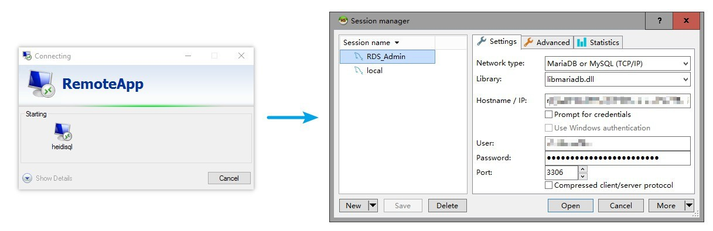
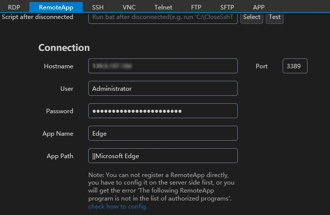
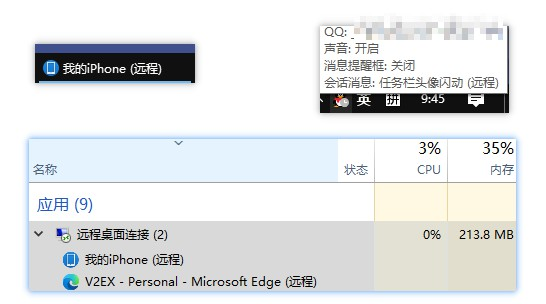

```A RemoteApp program is an application installed on an RD Session Host server. Remote Desktop Connection (RDC) and the RD Session Host use Remote Desktop Protocol (RDP) to redirect screen information for just the application instead of the full session-based virtual desktop.```



With RemoteApp programs, you can use RDS to make programs on a Remote Desktop Session Host (RD Session Host) server appear as if they are running on a user 's local computer. RemoteApp program windows are shown on and integrated with a client's Desktop instead of being presented as part of a session-based virtual desktop. A RemoteApp program open on a Desktop.

Using a RemoteApp program is similar to using a local application. When you implement RDS to provide access to a few applications, RemoteApp programs generally are easier for users to understand and use than session-based virtual desktops. Users can become confused when there is a session-based virtual desktop and a local Desktop. This is particularly true if the session-based virtual desktop is used in full-screen mode.

## How to use

### Step1

1. Open Server Manager. Select Remote Desktop Services > Collections.
2. Select the collection needed to configure application launcher.
3. Select RemoteApp Programs
4. In the RemoteApp Programs area, select Tasks select > Publish RemoteApp Programs.
5. Click Add on the Publish RemoteApp programs dialog.
6. Select **EXE** from the application launcher installation location on the server.
7. Click Next.
8. On the Confirmation page, click Publish.
9. Finish other confirmations.

## Step1 Another way

1. install [RemoteApp Tool](https://github.com/kimmknight/remoteapptool) on Server.
2. Create a RemoteApp by [RemoteApp Tool](https://github.com/kimmknight/remoteapptool)'s user guides, then [RemoteApp Tool](https://github.com/kimmknight/remoteapptool) will help you do Step1. 1-9

### Step2

Add a RemoteApp config in 1Remote.



Here I run QQ.exe and Edge.exe via RemoteApp:



!!! warning
    The following RemoteApp program are not in the list of authorized programs

    check list:

    - http://sbsfaq.com/the-following-remoteapp-program-is-not-in-the-list-of-authorized-programs-on-windows-essential-server/
    - https://www.beyondtrust.com/docs/privileged-identity/app-launcher-and-recording/installation/set-up-rds.htm


