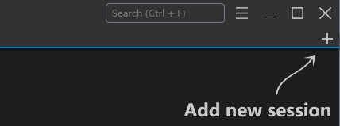
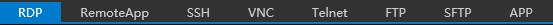

# {{appname}} Quick Start

    {{appname}} is open source and free to use.

## Installation

[Download](../download.md){ .md-button }

## Adding Servers

### Manually Adding a Server

1. Click the **`+`** button in the upper-right corner of the main window.

    

2. Choose a protocol, such as RDP, SSH, or VNC, at the top of the pop-up window.
    

3. Set the server's name, label, notes (supports Markdown), and other information and save.

[Learn more](/usage/overview/#adding-server){ .md-button }

#### Migrate from PRemoteM

!!! info "PRemoteM vs {{appname}}"
    {{appname}} is the upgraded version of PRemoteM.

Since PRemoteM is our old name, our migration tool will auto detect your old data when your first start 1Remote.

<image src="/usage/img/migrate-tools-for-prm.jpg" width="400px"></image>

If the you miss the auto-migration, you can still import it manually:

1. In PRemoteM export all data following the [Data export](usage/overview/#data-export) guide, you will get a *.prma file.
2. In 1Remote click the **`+`** button in the upper-right corner then click the **`Import`** button, select the *.prma file you just exported in the pop-up dialog by select the file filter \*\.\*, and click "Open" to complete the import.

## Starting Remote Connections

### Starting from the main window

Simply `double-click` a server to open the corresponding remote session.

### Starting from the Launcher

Press default shortcut ++alt++ + ++m++ to show the launcher, then:

- type the keyword to select server you want then press ++enter++ to start.
- ++right++ to show menu for the selected server.
- ++tab++ to show the [Quick Connect view](/usage/launcher/quick-connect/).

[Learn more](/usage/launcher/basic/){ .md-button }

## Customization

- Change language: **`Setting`** -> **`General`** -> **`Language`**
- Change theme: **`Setting`** -> **`Theme`** -> **`Theme`**. On this page, you can also customize your favorite color scheme.
- Change SSH color scheme: **`Setting`** -> **`Protocol`** -> **`SSH`** -> **`KiTTY`** -> **`Themes`**

[Learn more from the **Overview**](./overview.md){ .md-button }


