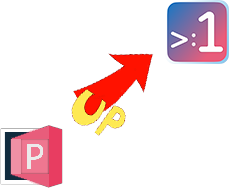

# {{name}} Quick Start

> {{name}} is the upgraded version of PRemoteM.
> {{name}} is open source and free to use.

## Installation

[Download](../download.md){ .md-button }

## Adding Servers

### Manually Adding a Server

1. Click the **`+`** button in the upper-right corner of the main window.
2. Choose a protocol, such as RDP, SSH, or VNC, at the top of the pop-up window.
3. Enter the server's name, label, notes (supports Markdown), and other information and save.

## Starting Remote Connections

### Starting from the main window

Simply double-click a server to open the corresponding remote session.
### Starting from the Launcher

Press default shortcut ++alt++ + ++m++ and select server you want then press ++enter++ to start.
## Customization

- Change language: **`Setting`** -> **`General`** -> **`Language`**
- Change theme: **`Setting`** -> **`Theme`** -> **`Theme`**. On this page, you can also customize your favorite color scheme.
- Change SSH color scheme: **`Setting`** -> **`Protocol`** -> **`SSH`** -> **`KiTTY`** -> **`Themes`**

[Learn more from the **Overview**](./overview.md){ .md-button .md-button--primary .inline .auto_width}


