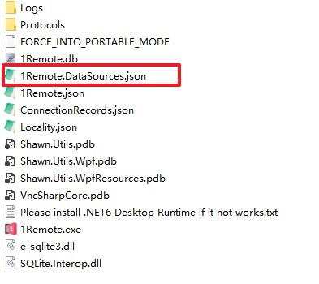

!!! warning
    Before deploy this app to your team, you need to set up a MySQL database for your team and create some user for your team members.

Assuming you are the IT administrator and you have already import servers into MySQL database, you can follow the steps below to deploy this app to your team.

1. Exit your MySQL admin account and login as a normal user in 1Remote. Make sure the database is `Readonly`:

    

2. Open explorer and navigate to the folder where you have installed 1Remote. Here is how the folder looks like:

    

3. **`1Remote.DataSources.json`** is where we keep MySQL connection string, share this file with your team members, placed it in the same folder with `1Remote.db`.
