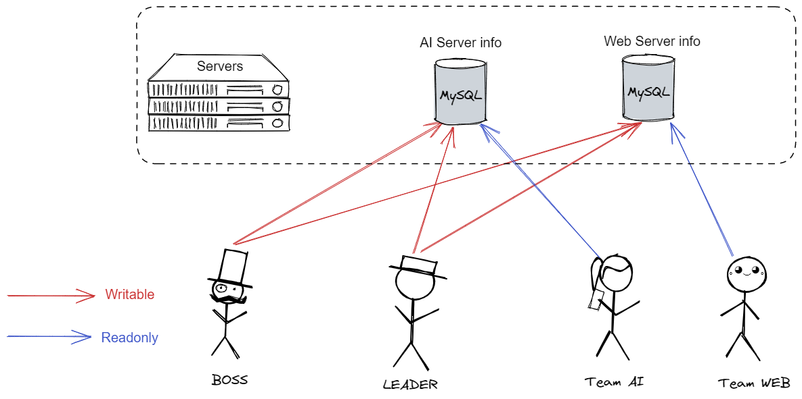
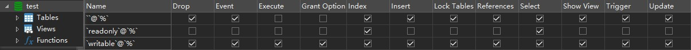
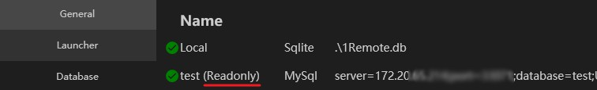
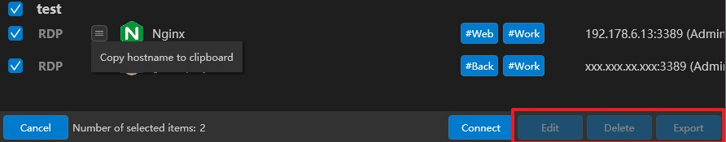

## Why

Assuming you are the team leader. In your company, you may have several servers to manage, AI Servers are for the AI team, while Web Servers are for the Web team.

A typical use case is:

- Only you and your boss have the permission to add and modify servers, while other colleagues can only view the servers listed, they are not able to edit them or see the password.
- AI team member can only access the AI servers, while Web team member can only access the Web servers.

1Remote can help you manage these servers flexibly with `Team sharing` feature.

In this feature, you can create two accounts in MySQL, giving them different permissions:

| Account                | Connect | View address | Edit | Delete | View password |
| ---------------------- | ------- | ------------ | ---- | ------ | ------------- |
| Select permission only | ✅       | ✅            | ❌    | ❌      | ❌             |
| Full permission        | ✅       | ✅            | ✅    | ✅      | ✅             |

Your team members can connect to the same database with read-only permission, they can only view the servers, but they are not able to edit them.

You can connect to the same database with full permission, you can add, edit and delete servers.

## How

1. Create two accounts in MySQL, giving them different permissions:

    

    In database "test", account 'writable' can insert and update data, while account 'readonly' can only select data.

2. You can connect to `test` database with account `writable`, and import servers into the database.
3. Your team member connect to `test` database with account `readonly`, they will not able to edit the servers, but they can view the servers and connect to them.

    Connection shows `Readonly`:

    

    Edit button of team member is disabled:

    

4. Once you edit the servers, the team member will see the changes in a few seconds.

!!! warning
    This app does not use concurrency locks on data editing, so if you modify the database on 2 devices at the same time, data loss may occur. Please try to avoid this situation.
